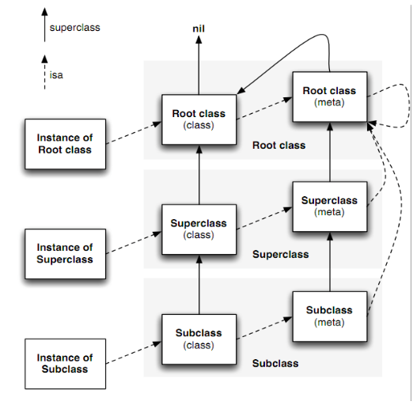

# Runtime

### 概念

**Objective-C** 是基于 C 的，它为 C 添加了面向对象的特性。它将很多静态语言在编译和链接时期做的事放到了 runtime 运行时来处理，可以说 **runtime** 是我们 Objective-C 幕后工作者。

- **runtime**（简称运行时），是一套 纯C(C和汇编写的) 的API。而 OC 就是 **运行时机制**，也就是在运行时候的一些机制，其中最主要的是 **消息机制**。
- 对于 C 语言，**函数的调用在编译的时候会决定调用哪个函数**。
- OC的函数调用成为消息发送，属于 **动态调用过程**。在编译的时候并不能决定真正调用哪个函数，只有在真正运行的时候才会根据函数的名称找到对应的函数来调用。
- 事实证明：在编译阶段，OC 可以 **调用任何函数**，即使这个函数并未实现，只要声明过就不会报错，只有当运行的时候才会报错，这是因为OC是运行时动态调用的。而 C 语言 **调用未实现的函数** 就会报错。

### 实例对象、类对象、元类

```C
struct objc_class {
    Class _Nonnull isa;

    Class _Nullable super_class;
    const char * _Nonnull name;
    long version;
    long info;
    long instance_size;
    struct objc_ivar_list * _Nullable ivars;
    struct objc_method_list * _Nullable * _Nullable methodLists;
    struct objc_cache * _Nonnull cache;
    struct objc_protocol_list * _Nullable protocols;
} ;
/* Use `Class` instead of `struct objc_class *` */

/// An opaque type that represents an Objective-C class.
typedef struct objc_class *Class;

/// Represents an instance of a class.
struct objc_object {
    Class _Nonnull isa  OBJC_ISA_AVAILABILITY;
};

/// A pointer to an instance of a class.
typedef struct objc_object *id;
```

实例对象：`struct objc_object`的指针。

类对象：`struct objc_class`的指针。

元类：`struct objc_class`的指针。

`struct objc_class`结构体定义了很多变量，通过命名不难发现，结构体里保存了指向父类的指针、类的名字、版本、实例大小、实例变量列表、方法列表、缓存、遵守的协议列表等，一个类包含的信息也不就正是这些吗？没错，`类对象`就是一个结构体`struct objc_class`，这个结构体存放的数据称为`元数据(metadata)`，该结构体的第一个成员变量也是`isa`指针，这就说明了`Class`本身其实也是一个对象，因此我们称之为`类对象`，`类对象`在编译期产生用于创建实例对象，是单例。

`类对象`中的`元数据`存储的都是如何创建一个实例的相关信息，那么`类对象`和`类方法`应该从哪里创建呢？就是从`isa`指针指向的结构体创建，`类对象`的`isa`指针指向的我们称之为`元类(metaclass)`，`元类`中保存了创建`类对象`以及`类方法`所需的所有信息，因此整个结构应该如下图所示:



### 关联对象

使用场景：
可以在类别中添加属性

- **设置关联值**

参数说明：
object：与谁关联，通常是传self
key：唯一键，在获取值时通过该键获取，通常是使用static const void *来声明
value：关联所设置的值
policy：内存管理策略，比如使用copy

```objective-c
void objc_setAssociatedObject(id object, const void *key, id value, objc _AssociationPolicy policy)
```

- **获取关联值**

参数说明：
object：与谁关联，通常是传self，在设置关联时所指定的与哪个对象关联的那个对象
key：唯一键，在设置关联时所指定的键

```objective-c
id objc_getAssociatedObject(id object, const void *key)
```

- **取消关联**

```objective-c
void objc_removeAssociatedObjects(id object)
```

- **关联策略**

```objective-c
typedef OBJC_ENUM(uintptr_t, objc_AssociationPolicy){
OBJC_ASSOCIATION_ASSIGN = 0,             // 表示弱引用关联，通常是基本数据类型
OBJC_ASSOCIATION_RETAIN_NONATOMIC = 1,   // 表示强引用关联对象，是线程安全的
OBJC_ASSOCIATION_COPY_NONATOMIC = 3,     // 表示关联对象copy，是线程安全的
OBJC_ASSOCIATION_RETAIN = 01401,         // 表示强引用关联对象，不是线程安全的
OBJC_ASSOCIATION_COPY = 01403            // 表示关联对象copy，不是线程安全的
};
```

### 方法、消息

#### **1、SEL**

SEL又叫选择器，是表示一个方法的selector的指针，其定义如下：

```
typedef struct objc_selector *SEL；
```

方法的selector用于表示运行时方法的名字。Objective-C在编译时，会依据每一个方法的名字、参数序列，生成一个唯一的整型标识(Int类型的地址)，这个标识就是SEL。
两个类之间，只要方法名相同，那么方法的SEL就是一样的，每一个方法都对应着一个SEL。所以在Objective-C同一个类(及类的继承体系)中，不能存在2个同名的方法，即使参数类型不同也不行
如在某一个类中定义以下两个方法: 错误

```
- (void)setWidth:(int)width;
- (void)setWidth:(double)width;
```

当然，不同的类可以拥有相同的selector，这个没有问题。不同类的实例对象执行相同的selector时，会在各自的方法列表中去根据selector去寻找自己对应的IMP。
工程中的所有的SEL组成一个Set集合，如果我们想到这个方法集合中查找某个方法时，只需要去找到这个方法对应的SEL就行了，SEL实际上就是根据方法名hash化了的一个字符串，而对于字符串的比较仅仅需要比较他们的地址就可以了，可以说速度上无语伦比！
本质上，SEL只是一个指向方法的指针（准确的说，只是一个根据方法名hash化了的KEY值，能唯一代表一个方法），它的存在只是为了加快方法的查询速度。
通过下面三种方法可以获取SEL:

- **sel_registerName函数**
- **Objective-C编译器提供的@selector()**
- **NSSelectorFromString()方法**

#### **2、IMP**

IMP实际上是一个函数指针，指向方法实现的地址。
其定义如下:

```
id (*IMP)(id, SEL,...)
```

第一个参数：是指向self的指针(如果是实例方法，则是类实例的内存地址；如果是类方法，则是指向元类的指针)
第二个参数：是方法选择器(selector)
接下来的参数：方法的参数列表。

前面介绍过的SEL就是为了查找方法的最终实现IMP的。由于每个方法对应唯一的SEL，因此我们可以通过SEL方便快速准确地获得它所对应的IMP，查找过程将在下面讨论。取得IMP后，我们就获得了执行这个方法代码的入口点，此时，我们就可以像调用普通的C语言函数一样来使用这个函数指针了。

#### 3、Method

Method用于表示类定义中的方法，则定义如下：

```objective-c
typedef struct objc_method *Method
struct objc_method{
    SEL method_name      OBJC2_UNAVAILABLE; // 方法名
    char *method_types   OBJC2_UNAVAILABLE;
    IMP method_imp       OBJC2_UNAVAILABLE; // 方法实现
}
```

我们可以看到该结构体中包含一个SEL和IMP，实际上相当于在SEL和IMP之间作了一个映射。有了SEL，我们便可以找到对应的IMP，从而调用方法的实现代码。

#### 4、方法调用

```objective-c
id _Nullable objc_msgSend(id _Nullable self, SEL _Nonnull op, …)
id _Nullable objc_msgSendSuper(struct objc_super * _Nonnull super, SEL _Nonnull op, …)
```

#### 5、消息转发

OC在想一个对象发送消息时，runtime根据对象的isa指针找到对象的类，在该类的方法以及父类的方法列表中寻找方法执行，如果都找不到，则抛出异常。但是在此之前还可以通过runtime避免崩溃

1. **Method resolution**

​    **OC**运行时会调用 `+(BOOL)resolveInstanceMethod:` 或者 +(BOOL)resolveClassMethod: 在该函数中可以为类添加实现。注：该方法只要返回NO 即使已经添加了实现也不会执行，返回YES会检查是否实现，实现也不会执行，到下一步：message forwarding。

2. **fast forwarding**

OC通过类的 `-(id)forwardingTargetForSelector:` 将消息转发给其它对象。注：方法返回非nil、非self则将消息转发给某个对象。返回self死锁，返回nil，则到下一步：normal forwarding。

3. **normal forwarding**

OC通过类的 `-(NSMethodSignature *)methodSignatureForSelector:` 方法获得函数的参数和返回值类型的函数签名。方法返回nil则报错。否则返回函数签名，并且系统创建NSInvocation对象，调用类的 -(void)forwardInvocation: 方法，在此方法中将消息转发出去。

### 方法交换

```objective-c
SEL originalSelector = @selector(viewWillAppear:);
SEL swizzledSelector = @selector(fe_viewWillApper:);

Method originalMethod = class_getInstanceMethod(class, originalSelector);
Method swizzledMethod = class_getInstanceMethod(class, swizzledSelector);

BOOL success = class_addMethod(class, originalSelector, method_getImplementation(swizzledMethod), method_getTypeEncoding(swizzledMethod));
if (success) {
	class_replaceMethod(class, swizzledSelector, method_getImplementation(originalMethod), method_getTypeEncoding(originalMethod));
} else {
	method_exchangeImplementations(originalMethod, swizzledMethod);
    }
});
```

