# 一、背景

近几年有赞零售业务快速发展，为了满足日益增多的业务需求，2019年起零售客户端发版改成了每周一次，在质量保障方面，技术团队要面对更大的挑战。故此我们团队做了很多研究，希望通过技术工具来提升移动端测试的质量和效率，这是我们研发移动端精准测试平台的初衷。  

目前业内移动端的测试手段主要有两种，一种是手工测试，手工测试是移动端目前主流的测试手段，一般流程是先根据业务场景梳理出对应的测试用例，然后将测试用例分配给开发和测试人员，由他们分别执行用例，排查问题；另外一种是单元测试，单元测试是通过工具进行自动化执行，执行完单元测试，除了根据单元测试的结果来判断代码质量，还可以获得对应的代码执行覆盖率的信息，这个是对单元测试结果的量化分析。这两种测试也有各自的不足，手工测试的覆盖范围依赖于相关人员的业务理解，缺少量化的评估，单元测试用例通常需要根据业务需求的迭代而频繁更新，维护成本较高。  
因此我们想要研发一个工具，可以支持手工测试的代码覆盖率分析，将两种测试手段的优势结合，这个工具就是移动端精准测试平台。  

本文会从iOS端来介绍精准测试的实现原理和我们的实践经验。

# 二、原理

代码覆盖率，顾名思义，就是代码在测试中被执行的比例，测试场景包括 **单元测试** 和 **系统测试** 。覆盖率结果主要分为以下两种：  
**行覆盖率**：用于度量工程中每行代码在测试中是否被执行。  
**分支覆盖率**：用于度量代码中每个判定分支是否被执行。

## 2.1 代码插桩

统计代码覆盖率的前提是对代码进行插桩，OC 是 C 语言的一个超集，而 LLVM 脱胎于 GCC，我们可以使用 GCC 的插桩器对 OC 代码进行编译插桩，具体流程如下：

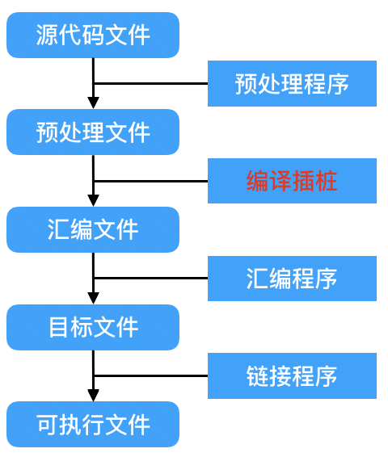

源代码在预处理程序处理后生成预处理文件，预处理文件经过编译程序编译后生成汇编文件。编译插桩就是在编译的过程中，向汇编代码中注入计数汇编代码，从而生成插了桩的汇编文件，再经过后续的汇编程序和链接程序生成可执行文件。同时，在编译完成时会另外生成一个 gcno 文件（源文件名.gcno）用于记录程序的桩点信息。插桩编译后的可执行文件在程序中执行后会生成带有统计信息的 gcda（源文件名.gcda）文件，两个文件一起用于代码执行的次数统计文件的生成。

### 2.1.1 基本块

从编译器角度看，基本块（[Basic Block](https://baike.baidu.com/item/基本块/6316788?fr=aladdin)，下文简称 BB）是代码执行的基本单元，LLVM 基于 BB 进行覆盖率计数指令的插入，BB 的特点是：  
1. 只有一个入口。
2. 只有一个出口。
3. 只要基本块中第一条指令被执行，那么基本块内所有指令都会**顺序执行一次**。

因此，一个函数的实现由 N 个基本块组成，示例如下：  

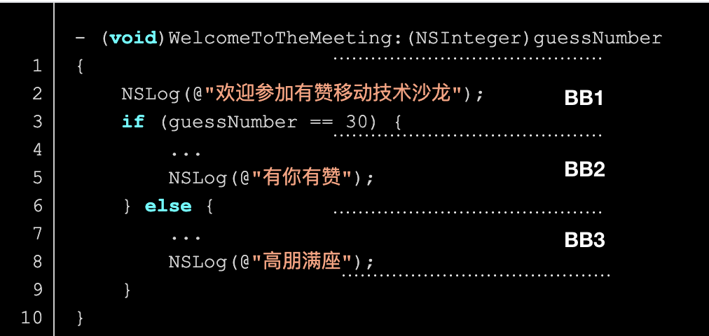

### 2.1.2 gcno 文件

一个源代码文件由 N 个函数组成，一个函数实现由 N 个基本块组成，插桩流程亦即：  
1. 遍历源代码文件中的所有函数，记录函数的位置信息：向 gcno 文件中写入函数名及行号。
2. 遍历函数中的所有基本块，创建计数器数组，用于运行时统计基本块执行情况：向 gcno 文件中写入基本块信息及块行号。

因此，gcno 文件由以下内容组成：  
1. 校验信息。
2. 编译时该文件的绝对路径。
3. 函数名及函数行号。
4. 基本块信息及基本块行信息。

图示如下：

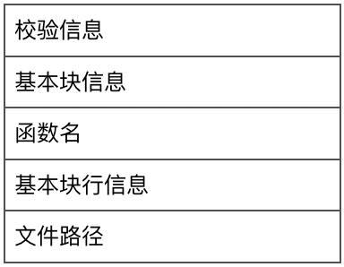

### 2.1.3 gcda 文件

插桩可执行文件执行后，我们可以调用 `__gcov_flush()` 函数将内存中的  BB 块执行情况的统计信息刷写到 gcda 文件中。gcda 文件由以下内容组成：  
1. 校验信息。
2. 函数名及执行次数。
3. 基本块标识及执行次数。

图示如下：

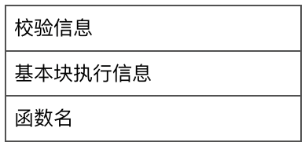

### 2.1.4 info 文件

拿到 gcno 和 gcda 文件后，我们可以使用  LCOV 工具（基于gcov ）来生成这个源代码文件的覆盖率信息。

覆盖率信息.info 文件包含以下内容：  
1. TN：测试用例名称
2. SF：源码文件路径
3. FN：函数名及行号
4. FNDA：函数名及执行次数
5. FNF：函数总数
6. FNH：函数执行数
7. DA：代码行及执行次数
8. LF：代码总行数
9. LH：代码执行行数

\* 在增量覆盖率信息统计的步骤中，我们给覆盖率信息文件新增了用于统计增量信息的字段：  
1. CA：差异代码行及执行次数
2. CF：差异代码行总数
3. CH：差异代码行执行数

## 2.2 iOS 工程配置

在 XCode 工程配置的 Build Settings 中，通过修改以下两个编译器参数即可实现插桩编译：  

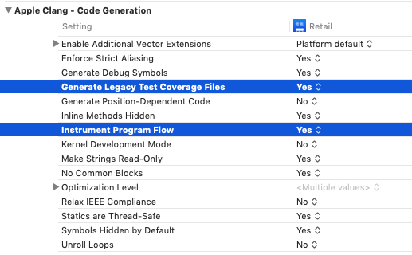

在待统计 `Target` 的 `Build Settings` 中分别设置 `Instrument Program Flow`、`Generate Legacy Test Coverage File` 为 `True`，即可快速打开插桩。

在 APP 运行过程中，调用 `__gcov_flush()` 函数将统计信息刷到本地。注意，在调用之前需要先设置环境变量如下：

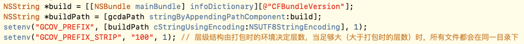

有赞零售iOS工程结构是在壳工程的基础上，通过子工程的方式接入各个业务模块（交易、商品、库存等），同时通过CocoaPod集成二方库和三方库。二方库和三方库是以二进制的形式集成，他们没法进行编译插桩，我们通过ruby脚本修改壳工程和相应的业务工程的编译配置，开启编译插桩能力。

# 三、系统架构

## 3.1 架构图
由原理可知，我们只要有 gcno 和 gcda 文件就可以得到代码覆盖率信息，我们的系统就是以这两个数据为基础，结合源码加工出我们需要的覆盖率信息：全量代码覆盖率、增量代码覆盖率。精准测试的架构设计如图：

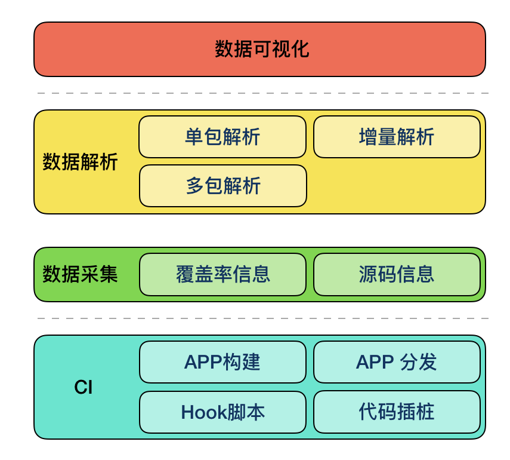

我们的系统分为 4 层：CI、数据采集、数据解析、数据可视化。

**CI 层**：主要负责插桩编译、APP 构建、APP 分发及 HOOK 脚本。在开发自测的流程中，在本机可以完成上述工作；在分发测试流程中，CI 层由有赞的 MBD 平台完成。机器在完成代码插桩编译、APP 构建之后，将编译的产物 gcno 文件打包上传至数据采集层的文件服务器，将构建产物 APP 分发至各测试设备，测试设备完成测试后将运行产物 gcda 打包上传至数据采集层的文件服务器。

**数据采集层**：主要负责收集上述产出的 gcno 和 gcda 文件。对每个上传的文件，我们要求附带参数信息用于标识数据对应的源码 commitId：

gcno 上传时的参数列表：

| 参数名   | 描述                                    |
| ------- | -------------------------------------- |
| platform | 平台：iOS，Android                      |
| bundleId | bundleId                                |
| branch   | 分支名                                  |
| commitId | 当前App对应的代码最后一次提交的commitId |
| build    | build 号                                |
| file     | 编译时生成的中间文件                    |

gcda 上传时的参数列表

| 参数名   | 描述                          |
| ------- | ---------------------------- |
| platform | 平台：iOS，Android            |
| bundleId | bundleId                      |
| build    | 分支名                        |
| uuid     | app 的 uuid，用于标识不同设备 |
| file     | 运行时生成的中间文件          |

**数据解析层**：负责向数据采集层拿到指定版本的覆盖率中间文件，然后生成对应的全量覆盖率数据、增量覆盖率数据，具体解析流程后续有详细描述。

**数据可视化**：负责将数据解析层生成的覆盖率数据，以可视化的方式（XML、HTML、消息通知等）展示出来。

## 3.2 时序图

上述系统在具体实现中，时序图如下：

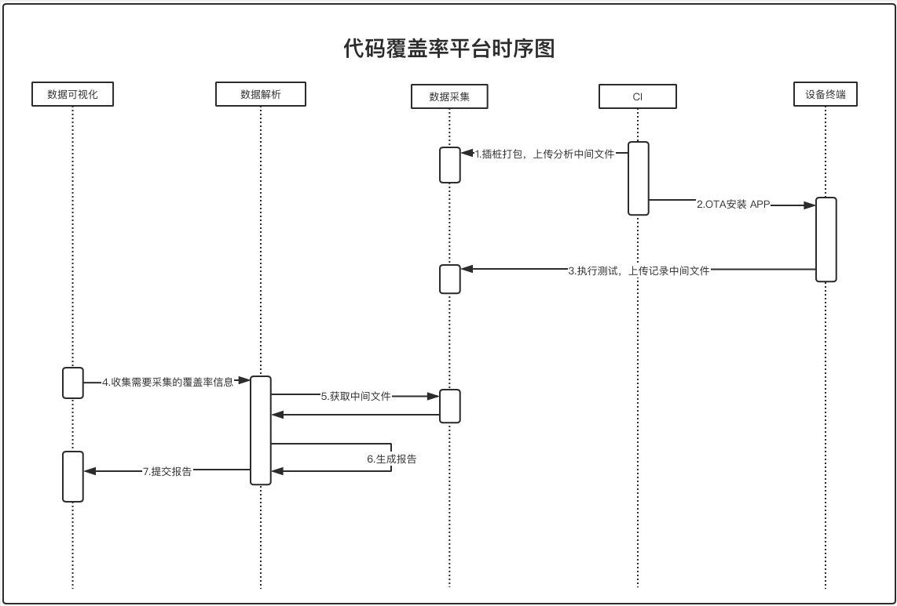

1. 打包机在打包的时候进行插桩编译。
2. 编译产物中：APP 用于分发安装，gcno 文件上传到文件系统中。
3. APP 测试完成后生成的 gcda 文件上传到文件系统中。
4. 在需要统计覆盖率信息的时候，前端页面输入相关参数。
5. 分析器根据参数向文件服务拿去对应的 gcno gcda 文件，然后生成报告。
6. 分析器通知相关人员报告结果。

## 3.3 覆盖率生成

我们使用开源的 LCOV 工具来处理 gcno 和 gcda 文件，生成可读性较高的 info 文件，同时支持生成可读性更好的 HTML 网页。LCOV 工具支持基于同一份 gcno 加上多份 gcda 的合并，因此，单版本多设备的全量代码覆盖率可可以很快的生成。

然而 LCOV 工具并不能满足我们的所有需求，在 **多版本之间的代码覆盖率迁移合并**、**基于 git diff 的增量代码覆盖率统计**、**基于增量代码覆盖率数据的报告展示** 等方面显得有些捉襟见肘。

### 3.3.1 单版本覆盖率

在单版本代码代码覆盖率的统计中，我们只需要调用 LCOV 工具的以下代码实现对应的功能（具体指令及参数的含义请参阅 [LCOV 工具](http://ltp.sourceforge.net/coverage/lcov.php)）：

**生成覆盖率**：`lcov -c --derive-func-data -d $SOURCE -o $DEST_INFO`  
**筛除数据**：`lcov -r $SOURCE_INFO '$REGEX' -o $DEST_INFO `   
**合并覆盖率**：`lcov -a $SOURCE_INFO_0 -a $SOUCE_INFO_n -o $DEST_INFO`

在生成了多次单版本的覆盖率数据后，我们思考着如何把上一次测试的代码覆盖率数据给利用起来。这样每个回归包只需要测试改动的内容，最后把所有的代码覆盖整合起来，就可以得到一个回归周期内所有改动的代码覆盖率了。

### 3.3.2 增量覆盖率

经过一段时间的探索和研究，我们最终实现了一套 **基于 git diff 的代码覆盖率行号平移、行号标记** 算法，完成了上述功能。

### 行号平移

对于多版本之间的覆盖率数据迁移工作，我们使用行号平移来实现。
行号平移的原理为：  
某源码文件在旧版本 A 有 100 行，在新版本 B 中有 120 行，其中改动的代码为 30 行，新增的代码为 20 行。在 git diff 中，此文件改动为：删除 30 行代码，新增 50 行代码。  
如果将旧版本的覆盖率数据迁移到适配新版本源码的覆盖率数据，需要根据 git diff 处理旧版覆盖率数据的行号信息。若为删除行，则旧版本对应行的覆盖率数据已经没用了，直接删除；再将剩余的覆盖率数据根据改动行号和差量（新增 - 删除）进行移动。

具体流程如下：

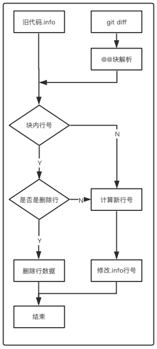

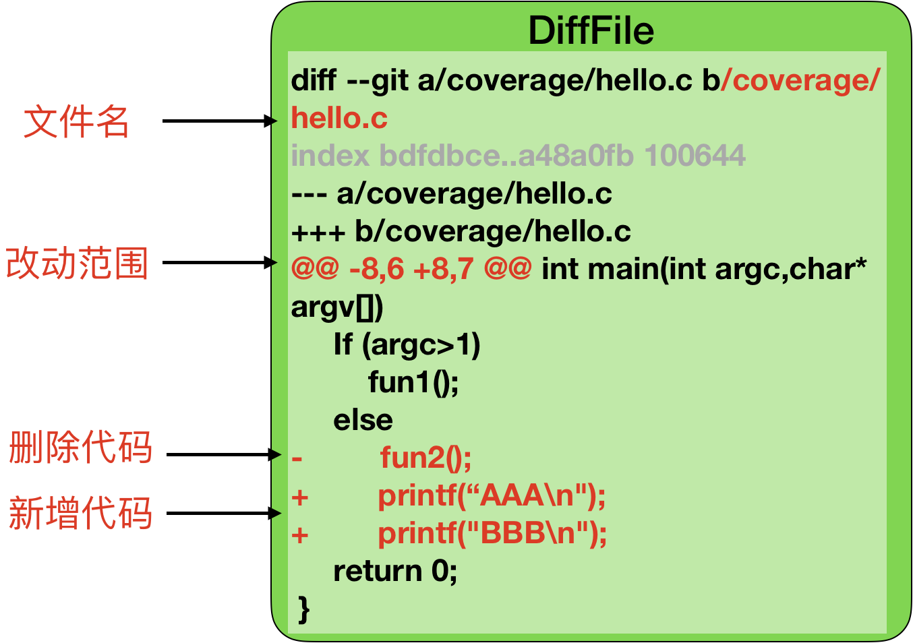

**1）解析 diffFile：**  
一个文件的 git diff 格式如上图所示，我们根据这个格式来解析 diffFile：  

1. 根据文件名匹配规则 `diff --git (.*)` 将 diffFile 解析为若干个文件的 diffInfoList，并且保存文件信息
2. 根据 diff 块匹配规则 `@@(.*)@@` 将每个文件的 diffInfo 解析为若干个 diff 块的 blockInfoList，并且保存块信息
3. 根据增 / 删代码匹配规则 `(\+|\-)(.*)` 将每个块的 blockInfo 解析为若干个修改行号的增 / 删行数，并保存增 / 删信息 `{'delLine': 10, 'delCount': 0, 'addLine': 10, 'addCount': 1}`

**2）解析 info 文件：**  

1. 根据文件名匹配 `SF:*end_of_record:` 规则将 info 解析为若干个文件的 fileInfoList，并且保存文件信息
2. 根据函数行、函数执行次数、代码行及执行次数匹配规则 `FN、FNDA、DA` 将每个文件的 fileInfo 解析为若干个执行信息的 daList，并且保存数据信息 `{'lineNo': 25, 'exeCount': 3, 'funName': 'fun2\n'}`

**3）生成 info 文件：**  

1. 根据 diffFile 解析结果，遍历 blockInfo 匹配起始修改行号 `delLine` 及修改行数 `diffline = addCount - delCount`，将 info 的解析结果进行行号匹配和增 / 删操作 ` if (lineNo > delLine) lineNo += diffLine`，修改 fileInfoList
2. 将新的 fileInfoList 中的数据根据 info 的结构进行写入文件操作

完成行号平移之后，两个版本的 .info 文件中的数据已经对齐了行号，可以用上述 LCOV 工具进行合并，合并完成后，用行号标记来统计差异的代码覆盖率数据。

多个版本合并流程就是以最新的版本作为基准版本，其他版本分别和它执行行号平移流程后合并，这里不再赘述。

#### 行号标记

对多版本合并后的数据，如果要进行差异化统计及展示（亦或者任意一个版本的覆盖率数据统计某两次提交之间的差异），我们使用行号标记来实现。行号标记的原理为：  
某源码文件在旧版本 A 有 100 行，在新版本 B 中有 120 行，其中改动的代码为 30 行，新增的代码为 20 行。在 git diff 中，此文件改动为：删除 30 行代码，新增 50 行代码。  
如果将新版本中的覆盖率数据相对于旧版本改动的行号标记出来，需要根据 git diff 处理新版覆盖率数据的行号信息。若为新增行则将新版本覆盖率数据中对应的行标记为差异行，其余不变。

 具体流程如下：

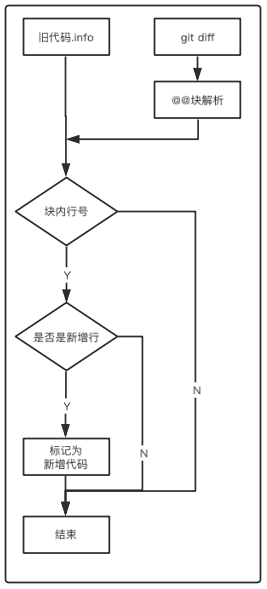

在行号标记流程中，**解析 diffFile、解析 info** 的步骤和行号迁移时一致，此处不重复描述，主要差异在于 **生成 info** 的步骤。在行号标记流程中的差异如下：

**3）生成 info 文件：**  
1. 根据 diffFile 解析结果，遍历 blockInfo 匹配起始修改行号 `addLine` 及修改行数 `addCount`，将 info 的解析结果进行行号匹配和标记 ` if (lineNo ∈ [addLine, addLine + addCount)) daInfo.isNewLine = true`，修改 fileInfoList
2. 将新的 fileInfoList 中的数据根据 info 的结构进行写入文件操作，同时将新增的 CA、CF、CH 数据填入 info 文件。

## 3.4 输出可视化数据

通过行号平移、行号标记后的覆盖率数据，经过数据可视化层处理后的结果，示例如下：

我们为增量代码覆盖率增加了以下内容：  
1. 针对所有代码新增一栏增量代码的覆盖率信息。
2. 针对每个文件都新增一栏增量代码的覆盖率信息。
3. 针对代码行标记出本行是否为改动代码（新增或者修改）。

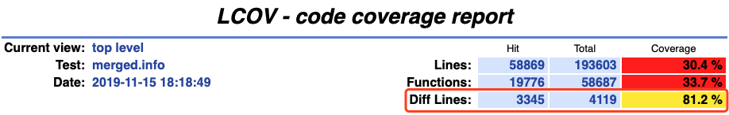

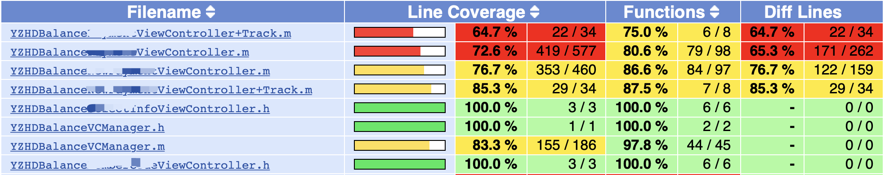

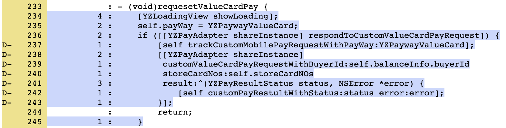

这样，在回归测试中，我们可以知晓改动部分代码的覆盖率信息，快速定位改动代码位置，帮助分析测试未覆盖原因，提升测试效率。

# 四、使用场景

由上述可知，我们可以得到单版本/多版本、单设备/多设备、全量/增量代码覆盖率信息，因此使用场景得到了极大的扩充。

### 开发自测覆盖率——增量代码覆盖率

开发者提交代码之前，需要在模拟器或者真机完成新增代码的自测。在提交代码时，git hook 脚本会对提交的代码进行增量代码覆盖率分析，生成报告及覆盖率数据，将报告地址和覆盖率数据添加到提交信息中。一方面，我们可以针对本次提交，设定覆盖率阈值，未达到阈值的提交可以强制拒绝或者增加提示。另一方面，在提交 MR 的时候，代码审查人员可以用这个增量覆盖率数据作参考。

### 自动化测试覆盖率——全量代码覆盖率

在打完包跑完自动化测试用例之后，我们可以拿到自动化用例的覆盖率数据。通过分析全量覆盖率，我们可以很快分析出用例的覆盖面及效率。一方面可以帮助精简用例集，快速制定高效用例，提高测试效率。另一方面可以帮助开发人员筛选冗余代码，优化代码质量。

### 测试回归覆盖率——增量代码覆盖率

在打完包跑完自动化测试用例之后，APP 被分发到测试人员的机器上，测试人员在完成测试工作后，我们会采集覆盖率数据做增量分析。每周的发版之前，每天定时收集当日测试覆盖情况，同步给相关测试人员及开发，发版当天，会对本周所有发版内容回归测试的结果进行覆盖率统计，做成覆盖率周报发给团队进行信息同步。达到精准化测试的目标。

在拿到覆盖率数据之后，我们着重观察未被测试覆盖的代码行，可以分析出其未被覆盖的原因和解决方案如下：  
**测试未覆盖**：需要测试人员针对特定场景进行针对性测试。  
**异常处理流程**：在单测中应该被覆盖；系统测试中尽量模拟场景。  
**冗余代码**：开发应及时进行优化。

# 五、总结与展望

通过精准测试系统，我们可以提升开发自测的质量和完善测试用例，目前我们的覆盖率报告还需要花费不少人力去分析和过滤，后续我们考虑对报告进行智能分析，输出更多维度的数据呈现。